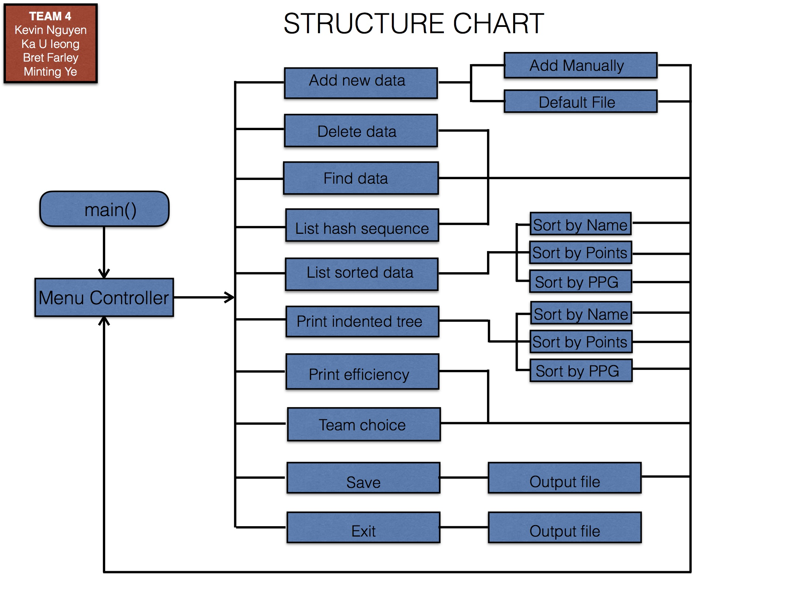

# Fantasy Football Spreadsheet CLI
An exploration of data abstraction and structures by creating a database to store, search, and sort players quickly.
A command-line program written completely in C++.

## Roles

> Kevin – Team Lead/BST
> - Program Integration
> - Code Main Menu (main.cpp)
> - BST coding
> - Assist HASH coding
> - Create Test Demonstration

> Johnny – I/O
> - File input/output
> - User input/output
> - Program Integration

> Minting – HASH
> - Code hash table
> - Create DSD and structure chart

## Features

> Key Implementations:
> - BST/AVL tree for quick sorting based on player statistics.
> - Hash Table w/ linked lists for quick searching and access of player data.
>   - Linked lists maintained in sorted order (alphabetically)
>   - Linked lists load factor: 1.724
>   - Longest Linked List: 5

### Program Flow Chart

### Data Structures Diagram

## Extras

[Program Demonstration](./docs/demo_manual.pdf)

[Docs](./docs)